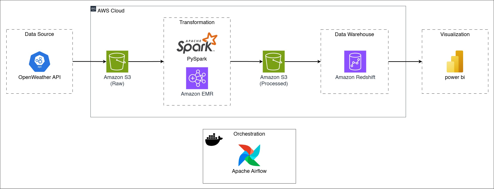
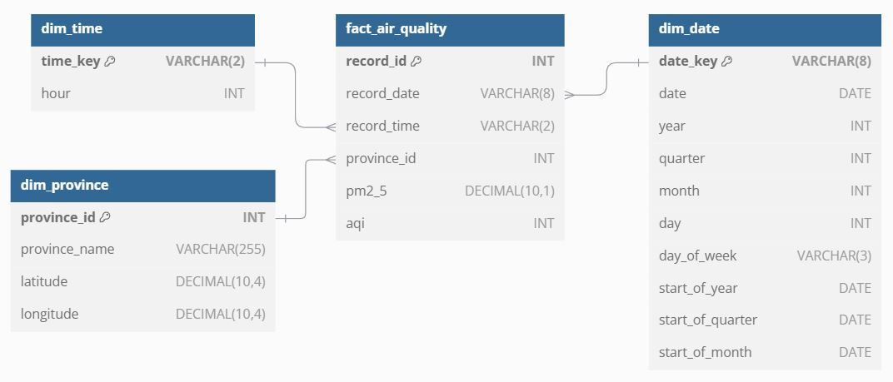
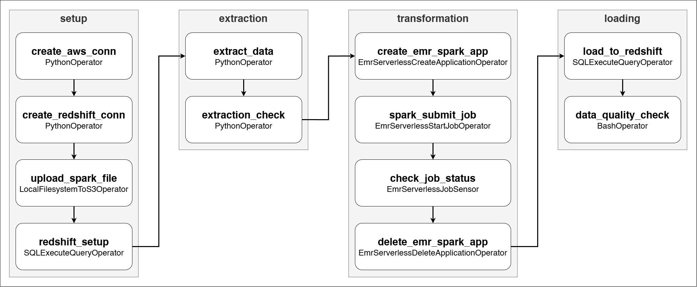

# 🚀 Data Pipeline Using Apache Airflow

This project leverages fundamental knowledge learned from various data engineering courses to build an end-to-end data pipeline for analysis and reporting.

## ✨ Overview

The project is designed to extract historical air pollution data of each province in Thailand from API. Data is then cleaned and transformed into fact and dimension tables format, aligned with a star schema in data warehouse. The dashboard visualizes air quality index (AQI) and PM2.5 concentration data over a 4-year period from 2021 to 2024.

### Objectives

- Automate data pipeline using AWS services and Apache Airflow.
- Develop dimensional data model to support querying and reporting.
- Develop a dashboard to visualize air quality trend and severity levels.

## 🏗️ Architecture

1. **Data Extraction:** Starting with data source, we use `OpenWeather API` as a source. Extraction is performed using `Python` to get data as `JSON` files.

2. **Data Storage:** Once we have our desired data extracted, we use `Amazon S3` buckets as staging area to store raw data before the transformation.

3. **Data Transformation:** Next, we read data from raw data bucket using `Apache Spark` running on `Amazon EMR Serverless` to clean and transform data. The processed data is then written back to S3 bucket.

4. **Data Warehousing:** Using `Amazon Redshift Serverless` as data warehouse to store processed data in dimensional model structure. The `COPY` command is used to load data from S3 to Redshift.

5. **Data Visualization:** As business intelligence layer, we use `Power BI` to create dashboard and visualize data from data warehouse.

6. **Pipeline Orchestration:** `Apache Airflow` running on `Docker` is used to automate the data pipeline.

7. **Data Quality:** Using `Soda` as data quality check tool to validate data in fact and dimension tables.

8. **Access Control:** We use `AWS IAM` to manage access and permissions. Roles, policies and credentials are created to control permissions for accessing AWS services.

*Pipeline Architecture*

## 🗂️ Data Model

It structured as star schema, a dimensional data model, to leverage denormalized approach for read-optimized. Fact table contains PM2.5 concentration value and AQI, while dimension tables provide context in date, time and province.

*Data Warehouse Model*

## 🌟 Airflow DAG

Tasks are organized by their respective roles.

*Pipeline DAG*

## ⚙️ Setup

1. **Amazon S3**

    We need to create 3 buckets.

    - `raw_bucket` to store raw data from extraction process.
    - `processed_bucket` to store processed data from transformation process.
    - `emr_bucket` to store pyspark script and EMR logs.
    
2. **Amazon EMR Serverless**

    Requirement for setting up EMR Serverless is creating an IAM role with necessary permissions for running spark job and writing logs.

    - **IAM Role**

        | Role             | Policy             | Resource                                          | Action          |
        |------------------|--------------------|---------------------------------------------------|-----------------|
        | EMR Runtime Role | EMR Runtime Policy | S3 `raw_bucket`, `processed_bucket`, `emr_bucket` | `s3:PutObject`  |
        |                  |                    |                                                   | `s3:GetObject`  |
        |                  |                    |                                                   | `s3:ListBucket` |

3. **Amazon Redshift Serverless**

    For compute resource, we use `8 RPUs` for the serverless workgroup. Publicly accessible must be `On`.
    
    Necessary security group and IAM role are listed as follows.

    - **Security Group**

        - Add `inbound` rule type `Redshift` with port range `5439`.

    - **IAM Role**

        | Role                 | Policy                                       | Resource              | Action                 |
        |----------------------|----------------------------------------------|-----------------------|------------------------|
        | Redshift Access Role | S3 Access Policy                             | S3 `processed_bucket` | `s3:GetObject`         |
        |                      |                                              |                       | `s3:GetBucketLocation` |
        |                      |                                              |                       | `s3:ListBucket`        |
        |                      | `AmazonRedshiftAllCommandsFullAccess` Policy | AWS Managed Policy    | AWS Managed Policy     |

After finished all AWS services setup, modify `.env` file with your own credentials then run `docker compose up` to start project.

## 📊 Dashboard Summary

Full dashboard files located in `dashboard` folder

- PM2.5 air pollution peaks in winter, with December, January and February being the most polluted months.

- PM2.5 concentrations are higher on weekdays than weekends, likely due to increased traffic and transportation.

- The Central and Northern regions experience higher pollution levels compared to other parts of the country, with Bangkok and its metropolitan area recording the highest AQI.